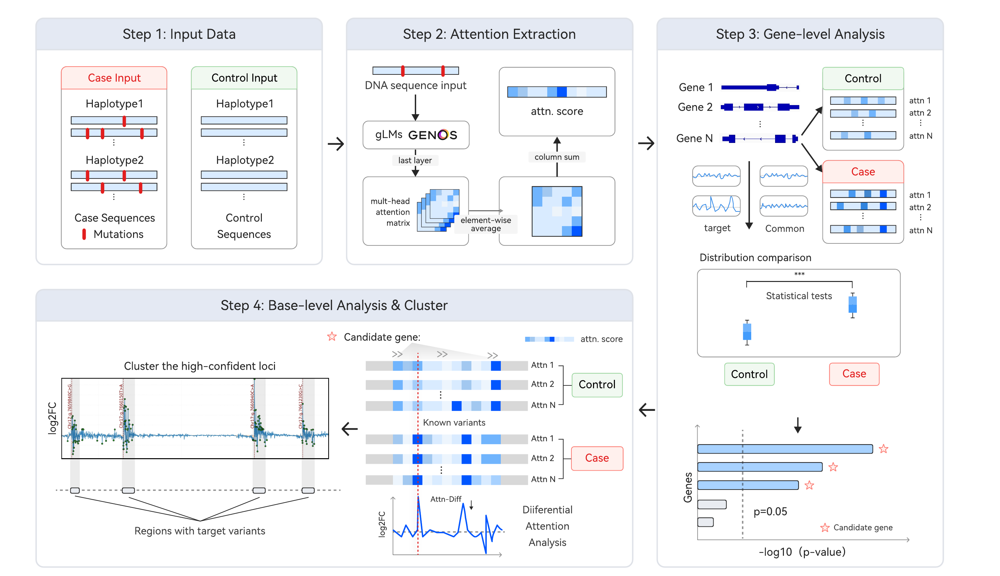

ATLAS: Attention-based Locus Analysis System

## 1. Introduction

ATLAS (Attention-based Locus Analysis System) is a computational framework that leverages genomic language models to identify disease-associated genetic variants through differential attention analysis. By analyzing attention patterns from pretrained genomic foundation models, ATLAS pinpoints pathogenic loci at single-nucleotide and haplotype resolution.

### Key Features

- 🧬 **Haplotype-resolved Analysis**: Works with phased genomic sequences from case-control cohorts
- 🤖 **Foundation Model Integration**: Extracts attention matrices from pretrained genomic language models (Genos-10B)
- 📊 **Multi-scale Analysis**: Performs both gene-level and base-level differential attention analysis
- 🎯 **High-resolution Mapping**: Identifies pathogenic regions at single-nucleotide resolution
- 💡 **Statistical Rigor**: Uses Mann-Whitney U tests with Benjamini-Hochberg correction

## 2. ATLAS Pipeline Overview

### Figure 1. ATLAS pipeline overview
[](./image/figure1.pdf)

ATLAS operates through four sequential steps:

### Step 1: Sequence Preparation
**Objective**: Process VCF files and prepare haplotype-resolved sequences

ATLAS operates on haplotype-resolved genomic sequences from case and control cohorts. Starting from VCF (Variant Call Format) files, sequences are extracted for specified genomic regions and labeled by sample type.

**Scripts**: `1.data_vcf2csv/`
- `1.vcf_extract.py` - Extract regions from VCF files
- `2.vcf2csv.py` - Convert per-region VCFs to labeled CSV sequences

### Step 2: Attention Extraction
**Objective**: Extract position-level attention scores from genomic language models

Each sequence is processed by a pretrained genomic language model (Genos-10B in this study), from which attention matrices are extracted from the final layer. Attention scores are averaged across heads and summarized per base by column-wise aggregation to obtain position-level importance scores.

**Scripts**: 
- `2.attn_score/export_attention_matrix_unified.py` - Unified attention extraction with automatic strategy selection
- `2.attn_score/calc_flash_attention_v2.py` - FlashAttention-based block computation helper
- Documentation: `../docs/attention_extraction_strategies.md`

**Three Strategies**:
- **Vanilla** (L ≤ 4,096): Standard attention for short sequences
- **FlashAttention-based** (4,096 < L ≤ 131,072): Memory-efficient block-wise computation
- **Chunked** (L > 131,072): Sliding-window for ultra-long sequences

### Step 3: Gene-level Differential Analysis
**Objective**: Identify candidate disease-associated genes through statistical testing

ATLAS performs gene-level differential attention analysis by comparing attention distribution statistics between case and control cohorts. The hypothesis is that pathogenic genes exhibit altered attention distributions relative to background genes.

**Scripts**: `3.gene_analysis/`
- `1.calculate_17metrics.py` - Compute 17 statistical metrics and perform Mann-Whitney U tests
- `2.barplot_17metrics.py` - Visualize significant genes with bar plots
- `3.boxplot_17metrics.py` - Generate detailed boxplots for individual genes

**17 Statistical Metrics**:
- Basic statistics (mean, std, median, max, CV, IQR, mode, percentiles)
- Distribution features (skewness, kurtosis)
- Complex metrics (top5%, low5%, peak count/density, Shannon entropy)

### Step 4: Base-level Differential Analysis
**Objective**: Identify and cluster pathogenic loci within candidate genes

Within candidate genes, ATLAS conducts base-level differential attention analysis to identify loci with significant attention shifts between cohorts. High-confidence loci are clustered into contiguous genomic regions, yielding candidate pathogenic regions at single-nucleotide and haplotype resolution.

**Scripts**:
- `4.base_analysis/analyze_base_signal.py` - Perform log2 fold-change analysis at base resolution
- `4.base_analysis/cluster_base_signal.py` - Cluster significant loci into contiguous regions

**Analysis Methods**:
- Log2 fold-change calculation between case and control attention scores
- Statistical significance testing at each genomic position
- Clustering of significant loci into candidate pathogenic regions

## 3. Installation

### Prerequisites

- Python 3.8+
- CUDA-capable GPU (for attention extraction)
- bcftools (for VCF processing)
- Perl (for sequence extraction)

### Dependencies

Install required Python packages:

<!-- ```bash
pip install torch transformers
pip install pandas numpy scipy statsmodels
pip install matplotlib seaborn
pip install biopython tqdm pyarrow
pip install flash-attn  # For FlashAttention-based extraction
``` -->
```bash
pip install -r requirements.txt  # If available
```

### Model Download

Download the pretrained genomic language model:

```bash
# Example: Genos-10B or similar genomic foundation model
# Place model in /path/to/model/
```

## 4. Quick Start

From the repository root:
```bash
cd ATLAS
```

### Step 1: Prepare Sequences from VCF

```bash
cd 1.data_vcf2csv

# 1.1 Extract regions from VCF
python 1.vcf_extract.py \
    --region-file regions.txt \
    --vcf input.vcf \
    --out-dir vcf_output \
    --max-workers 8

# 1.2 Convert to labeled CSV
python 2.vcf2csv.py \
    --region-file regions.txt \
    --vcf-dir vcf_output \
    --fasta GRCh38.fa \
    --perl-script extract_variant_sequences_with_ref_loci.pl \
    --sample-type-file sample_type.csv \
    --out-dir labeled_csv \
    --max-workers 8
```

**Region file format**: `chr:start-end:strand    gene` (0-based start coordinate)

### Step 2: Extract Attention Scores

```bash
cd ../2.attn_score

# Automatic strategy selection based on sequence length
python export_attention_matrix_unified.py \
    --input_csv ../1.data_vcf2csv/labeled_csv/chr_start_end_forward_GENE.label.csv \
    --model_path /path/to/model \
    --vcf_file variants.vcf \
    --output_dir ../results/attention_scores/GENE/ \
    --strategy auto \
    --gpu_id 0
```

**Output**:
- `metadata.csv` - Sample IDs and labels
- `hap1_attention_collapsed.csv` - Attention scores for haplotype 1
- `hap2_attention_collapsed.csv` - Attention scores for haplotype 2
- `timing_stats.json` - Performance statistics

### Step 3: Gene-level Analysis

```bash
cd ../3.gene_analysis

# 3.1 Calculate 17 metrics and perform statistical tests
python 1.calculate_17metrics.py

# 3.2 Generate bar plot visualization
python 2.barplot_17metrics.py

# 3.3 Generate boxplot for specific gene
python 3.boxplot_17metrics.py
```

Note: the scripts in `3.gene_analysis/` currently use hard-coded `root_path` / `save_path` variables; update them to point at your `ATLAS/results/attention_scores/` (or `../results/attention_scores/` when running inside `3.gene_analysis/`) and desired output folder before running.

**Required directory structure**:
```
ATLAS/results/attention_scores/
├── gene1/
│   ├── hap1_attention_collapsed.csv
│   ├── hap2_attention_collapsed.csv
│   └── metadata.csv
├── gene2/
│   └── ...
```

**Output**:
- `17stats_pvalues_with_BH_correction.csv` - Statistical test results for all genes
- `significant_genes_BH_17pvalue.png/pdf` - Bar plots of significant genes
- `{gene}_17metrics_hap1_box.pdf` - Detailed boxplots

### Step 4: Base-level Analysis

```bash
cd ../4.base_analysis

# 4.1 Perform log2 fold-change analysis
python analyze_base_signal.py \
    --input ../results/attention_scores/candidate_gene/ \
    --output ../results/base_analysis/

# 4.2 Cluster significant loci
python cluster_base_signal.py \
    --input ../results/base_analysis/log2fc_scores.csv \
    --output ../results/clustered_regions/ \
    --threshold 0.05
```

**Output**:
- Log2 fold-change scores at each genomic position
- Clustered pathogenic regions with statistical significance
- Visualization of attention patterns across loci

## 5. Project Structure

```
ATLAS/
├── readme.md                                    # This file
├── requirements.txt
│
├── 1.data_vcf2csv/                              # Step 1: Sequence preparation
│   ├── 1.vcf_extract.py                         # Extract regions from VCF (bcftools)
│   ├── 2.vcf2csv.py                             # Convert per-region VCFs to labeled CSV
│   └── extract_variant_sequences_with_ref_loci.pl
│
├── 2.attn_score/                                # Step 2: Attention extraction
│   ├── export_attention_matrix_unified.py
│   └── calc_flash_attention_v2.py
│
├── 3.gene_analysis/                             # Step 3: Gene-level differential analysis
│   ├── 1.calculate_17metrics.py
│   ├── 2.barplot_17metrics.py
│   └── 3.boxplot_17metrics.py
│
└── 4.base_analysis/                             # Step 4: Base-level differential analysis
    ├── analyze_base_signal.py
    └── cluster_base_signal.py
```

## 6. Input/Output Formats

### Input Data Requirements

**Step 1 Input**:
- VCF file with phased genotypes
- Region file: `chr:start-end:strand    gene` (tab-separated)
- Reference genome FASTA (e.g., GRCh38)
- Sample metadata CSV with columns: `sample`, `sample_type` (0=control, 2=case)

**Step 2 Input**:
- Labeled sequence CSV from Step 1
- Pretrained genomic language model
- Optional: VCF file for haplotype information

**Step 3 Input**:
- Directory of gene folders, each containing:
  - `hap1_attention_collapsed.csv`
  - `hap2_attention_collapsed.csv`
  - `metadata.csv`

**Step 4 Input**:
- Attention score files from Step 2
- Statistical results from Step 3 (for candidate gene selection)

### Output Data Formats

**Step 2 Output**:
- CSV/Parquet files with attention scores per position
- Columns: `sample`, `pos_1`, `pos_2`, ..., `pos_N`

**Step 3 Output**:
- Statistical results CSV with 52 columns:
  - `gene` name
  - 17 × `{metric}_p` (original P-values)
  - 17 × `{metric}_p_corrected` (BH-corrected P-values)
  - 17 × `{metric}_significant` (Boolean significance flags)

**Step 4 Output**:
- Log2 fold-change scores per genomic position
- Clustered pathogenic regions with coordinates and P-values

## 7. Performance and Scalability


### Recommendations

- **Short sequences (≤4K)**: Use vanilla strategy for maximum speed
- **Medium sequences (4K-131K)**: Use FlashAttention-based strategy for memory efficiency
- **Long sequences (>131K)**: Use chunked strategy with appropriate overlap
- **Memory-constrained**: Reduce `--block_rows` or `--chunk_size` parameters

## 8. Citation and Acknowledgments

<!-- If you use ATLAS in your research, please cite:

```bibtex
@article{atlas2026,
  title={ATLAS: Attention-based Locus Analysis for Disease Gene Discovery},
  author={Your Name et al.},
  journal={Journal Name},
  year={2026},
  url={https://github.com/BGI-HangzhouAI/ATLAS}
}
``` -->
<!-- 
- **Genomic Foundation Models**: Genos series and similar pretrained models
- **FlashAttention**: Dao et al. (2022) for memory-efficient attention algorithms
- **Statistical Methods**: Benjamini-Hochberg procedure for multiple testing correction -->
We would like to acknowledge the Human Pangenome Reference Consortium (BioProject ID: PRJNA730823) and its funder, the National Human Genome Research Institute (NHGRI).

## 9. License

This project is released under the [MIT License](LICENSE).

<!-- ## 10. Troubleshooting

### Common Issues

**Out of Memory during Attention Extraction**:
- Reduce `--block_rows` for flash strategy (default: 1024 → 512)
- Use chunked strategy for very long sequences
- Reduce batch size if processing multiple samples

**VCF Processing Errors**:
- Ensure bcftools is installed and in PATH
- Check VCF file is properly indexed (`.vcf.gz.tbi`)
- Verify region coordinates are 0-based

**Statistical Test Failures**:
- Ensure adequate sample size (≥3 per group recommended)
- Check metadata.csv uses correct encoding (0=control, 2=case)
- Verify sample names match between attention files and metadata

**Visualization Issues**:
- Install required fonts for matplotlib
- Increase figure DPI for higher resolution
- Adjust figure size for many genes/metrics

## 11. Contact

For project-related questions, please raise an issue or contact the project maintainer at xxx@zhejianglab.org.

For general inquiries, you are also welcome to contact us at opensource@zhejianglab.org. -->